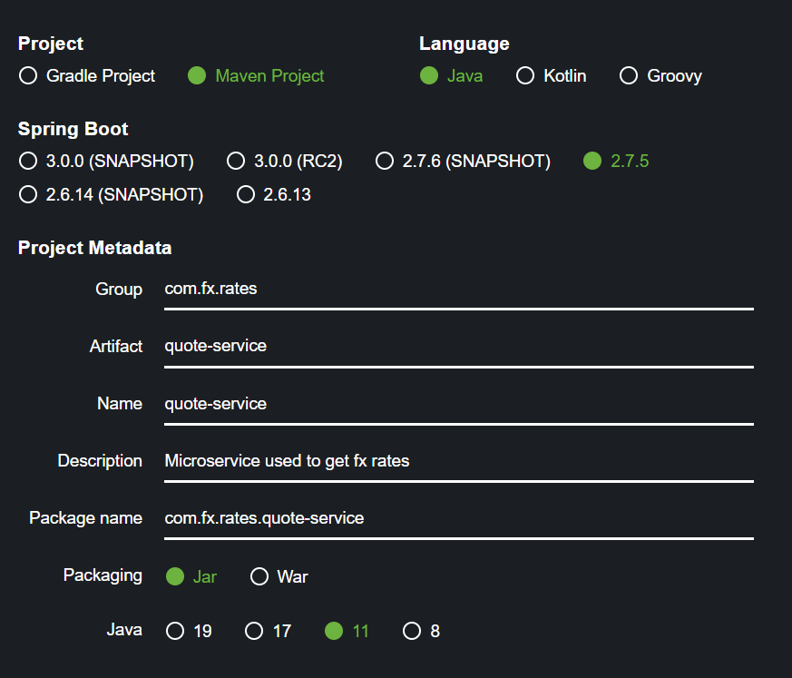

# Week 8 - Development Create Quote Service Microservice With Spring

<br> The purpose of this lab is to implement the quote-service Microservice, which will return FX Rates for our fx-trading-app.

## Table of contents

- [Exercise 1 - Create project](#exercise-1---create-project)
- [Exercise 2 - Currency enum and RateDto](#exercise-2---create-currency-enum-and-ratevo)
- [Exercise 3 - Create controller](#exercise-3---)
- [Exercise 4 - Check](#exercise-4--)
- [Exercise 5 - Add quote logic](#exercise-5---)
- [Exercise 6 - Tidy up](#exercise-6---)

## Pre-requisites
- Java 11
- Maven
- Postman
- IntelliJ IDEA

## Exercise 1 - Create project

Use spring initializer(https://start.spring.io) to create a new project which has the same parameters as those defined in the following image. Add Spring Web as dependency and generate the project. After the project was generated, open it using IntelliJ IDEA.  



## Exercise 2 - Currency enum and RateDto

Create an enumeration for currencies (ECurrency). Add a label for each element using the constructor(https://www.baeldung.com/java-enum-values &rarr; 3. Adding a Constructor and a Final Field).

```JAVA
package com.fx.rates.quoteservice;

public enum ECurrency {
    // TODO Add eur, ron, gbp, usd currencies
    
    // TODO Add label property
    
    // TODO Add constructor with label property as parameter
}
```


Create RateDto class

```JAVA
package com.fx.rates.quoteservice;

public class RateDto {
    // TODO Add buyRate, sellRate, timestamp fields
    
    // TODO Add constructor
}
```


## Exercise 3 - Create controller

Create the FXController class. The controller should have 2 endpoints: one for getting the available currencies and one for getting fx-rates for a currency pair (https://howtodoinjava.com/spring5/webmvc/controller-getmapping-postmapping/ &rarr; 2. Spring @GetMapping Example) 

```JAVA
package com.fx.rates.quoteservice;

@RestController
public class FXRateController {
    // TODO getCurrencies
    // hint:ENUM.values()
    // return List<String>

    // TODO getRates: primaryCcy, secondaryCcy
    // return RateDto
}
```

## Exercise 4 - Check

Set the server port in the application.properties file (can be found in the resources directory).
```
spring.application.name=quote-service
server.port=8220
```

Start the app and then use Postman to test the quote-service:
- get the available currencies: localhost:8220/currencies 
- get some fx-rates from the defined REST endpoints: localhost:8220/fx-rate?primaryCcy=USD&secondaryCcy=EUR

## Exercise 5 - Add quote logic

Add quote logic in Controller

```JAVA
    private static final float MAX_VALUE_FOR_DELTA = 0.9F;
	private static final Map<ECurrency, Map<ECurrency, Float>> RATES = new HashMap<ECurrency, Map<ECurrency, Float>>();
	private static final Map<ECurrency, Float> EUR_RATES = new HashMap<ECurrency, Float>();
	private static final Map<ECurrency, Float> USD_RATES = new HashMap<ECurrency, Float>();
	private static final Map<ECurrency, Float> GBP_RATES = new HashMap<ECurrency, Float>();
	private static final Map<ECurrency, Float> RON_RATES = new HashMap<ECurrency, Float>();

 / Static block is used for initializing the static variables.
 //This block gets executed when the class is loaded in the memory
 //can we have more than one?

	static {
		EUR_RATES.put(ECurrency.GBP, 0.9F);
		EUR_RATES.put(ECurrency.USD, 1.18F);
		EUR_RATES.put(ECurrency.RON, 4.66F);
		EUR_RATES.put(ECurrency.EUR, 1F);
		RATES.put(ECurrency.EUR, EUR_RATES);

		USD_RATES.put(ECurrency.GBP, 0.76F);
		USD_RATES.put(ECurrency.RON, 3.96F);
		USD_RATES.put(ECurrency.USD, 1F);
		RATES.put(ECurrency.USD, USD_RATES);

		GBP_RATES.put(ECurrency.GBP, 1F);
		GBP_RATES.put(ECurrency.RON, 5.18F);
		RATES.put(ECurrency.GBP, GBP_RATES);

		RON_RATES.put(ECurrency.RON, 1F);
		RATES.put(ECurrency.RON, RON_RATES);
	} 


	private static final Map  ratesTS = new ConcurrentHashMap<String, RateVO>();  //TODO add rates to map => return same value for multiple requests in a moment


		public RateVO getRate(String fromS, String toS) {
    		ECurrency from = ECurrency.getByLabel(fromS.toUpperCase());
    		ECurrency to = ECurrency.getByLabel(toS.toUpperCase());
    
    		//received unknown currency
    		if (from == null || to == null) {
    			return null;
    		}
    
    
    		Map<ECurrency, Float> fromRates = RATES.get(from);
    		Float baseRate = fromRates.get(to);
    
    		//received Unkown Currency Pair
    		if (baseRate == null && RATES.get(to).get(from) == null) {
    			return null;
    		}
    
    		if (baseRate == null) {
    			baseRate = 1.0F/RATES.get(to).get(from);
    		}
    	
    
    		float buyRate = baseRate != 1 ? baseRate + getRandomizedDelta(0, baseRate) : 1;
    		float sellRate = baseRate != 1 ? baseRate - getRandomizedDelta(0, baseRate) : 1;
    		return new RateVO(buyRate, sellRate, new Date());
    
    
    
    	}
    
    	private static float getRandomizedDelta(float min, float max) {
    
    		Random rand = new Random();
    
    		float result = rand.nextFloat() * (max - min) + min ;
    
    		return result;
    
    	}
```

Add missing code to ECurrency
```JAVA
    private static final HashMap<String, ECurrency> MAP = new HashMap<String, ECurrency>();

    static {
		for (ECurrency currency : ECurrency.values()) {
			MAP.put(currency.getLabel(), currency);
		}
	} 
   
	
	public static ECurrency getByLabel(String label) {
		return MAP.get(label);
	}
	
```


## Exercise 6 - Tidy up

Tidy up code: add quoteService and move quote logic from controller

```
	@Autowired
	IQuoteService quoteService;
```
